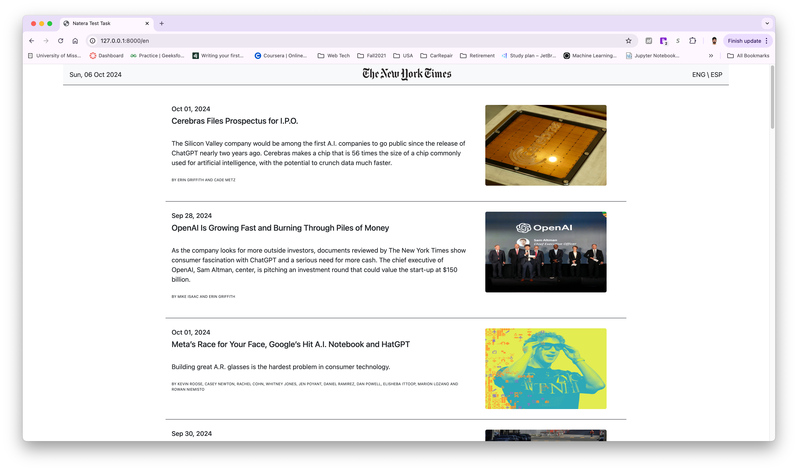

# Natera Test Task
It is required to build a single page application that displays data, provided by NYT Technology RSS.
RSS URL: https://rss.nytimes.com/services/xml/rss/nyt/Technology.xml
Expected layout is attached to this email.

## Backend requirements:
- fetch data from RSS.
- cache it for 15 minutes (optional).

## UI requirements:
- Header gets sticky during scrolling and overrides main list items.
- All data output is based on the backend response.
- Font sizes are up to you,  just keep a general proportions.
- Click on a article’s title, short description, image should open a new tab with the main article
- Click on eng | esp should change the language

## How to run
1. `cd task`
2. `python -m venv env`
3. `source env/bin/activate`
4. `pip install -r requirements.txt`
5. `fastapi dev main.py`

Go to `http://127.0.0.1:8000/` in your browser.
-> Click on blog area to view blog post on NYT website.
-> Click on ENG or ESP (top right corner of the page) to change the language of blog titles.
-> Top left corner of the page show current date.

## Technologies/Libraries used

1. Python
2. FastAPI
3. Jinja2
4. HTML
5. translate library (for language change)
6. xmltodict library (for parsing xml data to dictionary)

## Screenshots

1. Main Page

2. ESP page

3. ENG Page

